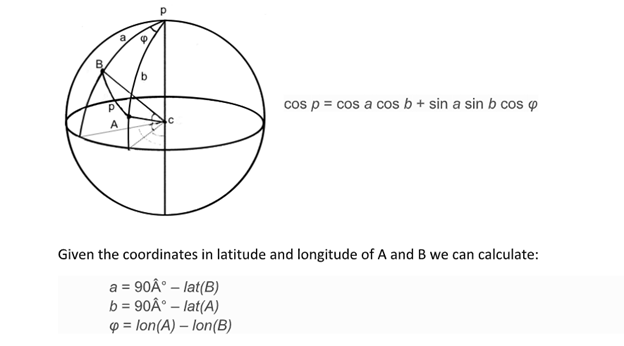
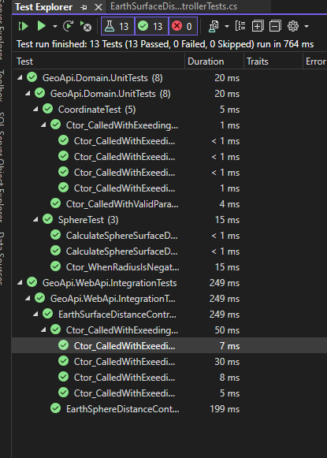

# Geo.Api

Api for geographical calculation.

## Functionalities

### Spheral model to calculate distance



Model considerations included in [Distance Between Two Points Analysis](Distance%20between%20two%20points-analysis.docx) file.

## Api usecase 

Program accepts gegraphical coordinates and produce response with distance between them. 
For eample:
```
POST ~​/api​/v1​/Earth​/surfaceDistanse​
{
    “LatitiudeA”: “<latA:double:range[-90,90]>”,
    “longitudeA”: “<longA:double:range[-180,180]>”,
    “LatitiudeB”: “<latB:double:range[-90,90]>”,
    “longitudeB”: “<longB:double:range[-180,180]>”
}
```
Will produce HTTP 200 with following body:
```json
{
  "distance": <double>
}
```
**Remark**: Proper endpoint method seemed to be GET, however there were problems with HttpClient integration test, as during sending request routing was encoded and api didn reognize parameter returning 404, thus POST option was promoted.

# Tests
Most important part of solution are covered with unit and integration tests:

